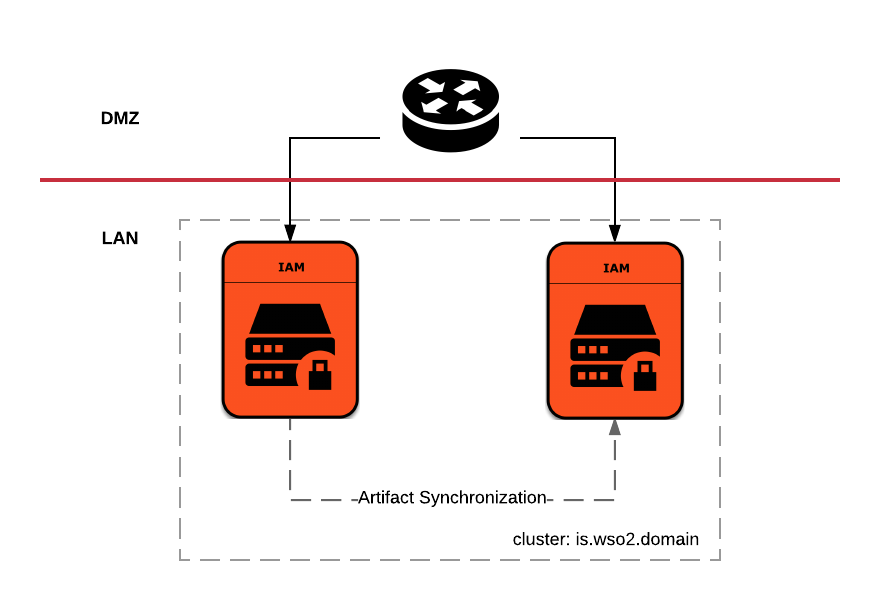
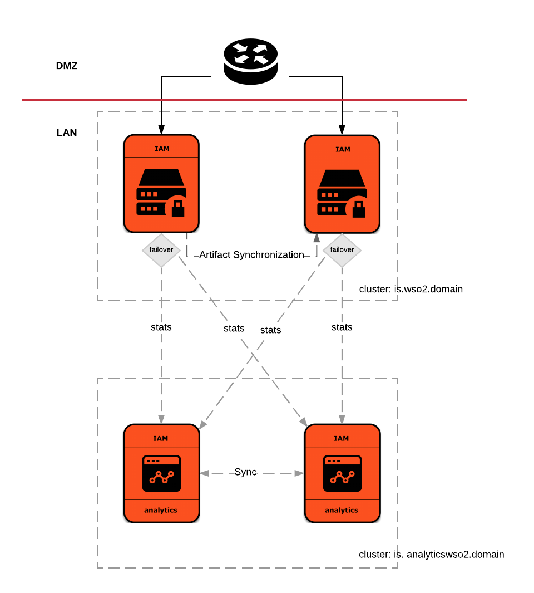

# Kubernetes and Helm Resources for WSO2 Identity Server
*Kubernetes and Helm Resources for container-based deployments of WSO2 Identity Server deployment patterns*

This repository contains Kubernetes and Helm resources required for,

* A clustered deployment of WSO2 Identity Server



* A clustered deployment of WSO2 Identity Server with Analytics support



## Deploy Kubernetes resources

In order to deploy Kubernetes resources for each deployment pattern, follow the **Quick Start Guide**s for each deployment pattern
given below:

* [A clustered deployment of WSO2 Identity Server](is/README.md)

* [A clustered deployment of WSO2 Identity Server with Analytics support](is-with-analytics/README.md)

## Deploy Helm resources

In order to deploy Helm resources for each deployment pattern, follow the **Quick Start Guide**s for each deployment pattern
given below:

* [A clustered deployment of WSO2 Identity Server](helm/is/README.md)

* [A clustered deployment of WSO2 Identity Server with Analytics support](helm/is-with-analytics/README.md)

## How to update configurations

Kubernetes resources for WSO2 products use Kubernetes [ConfigMaps](https://kubernetes.io/docs/tasks/configure-pod-container/configure-pod-configmap/)
to pass on the minimum set of configurations required to setup a product deployment pattern.

For example, the minimum set of configurations required to setup a clustered deployment of WSO2 Identity Server can be found
in `<KUBERNETES_HOME>/is/confs` directory. The Kubernetes ConfigMaps are generated from these files.

If you intend to pass on any additional files with configuration changes, third-party libraries, OSGi bundles and security
related artifacts to the Kubernetes cluster, you may mount the desired content to `/home/wso2carbon/wso2-server-volume` directory path within
a WSO2 product Docker container.

The following example depicts how this can be achieved when passing additional configurations to WSO2 Identity Server nodes
in a clustered deployment of WSO2 Identity Server:

**a**. In order to apply the updated configurations, WSO2 product server instances need to be restarted. Hence, un-deploy all the Kubernetes resources
corresponding to the product deployment, if they are already deployed.

**b**. Create and export a directory within the NFS server instance.
   
**c**. Add the additional configuration files, third-party libraries, OSGi bundles and security related artifacts, into appropriate
folders matching that of the relevant WSO2 product home folder structure, within the previously created directory.

**d**. Grant ownership to `wso2carbon` user and `wso2` group, for the directory created in step (b).
      
   ```
   sudo chown -R wso2carbon:wso2 <directory_name>
   ```
      
**e**. Grant read-write-execute permissions to the `wso2carbon` user, for the directory created in step (b).
      
   ```
   chmod -R 700 <directory_name>
   ```

**f**. Map the directory created in step (b) to a Kubernetes [Persistent Volume](https://kubernetes.io/docs/concepts/storage/persistent-volumes/)
in the `<KUBERNETES_HOME>/is/volumes/persistent-volumes.yaml` file. For example, append the following entry to the file:

```
apiVersion: v1
kind: PersistentVolume
metadata:
  name: identity-server-additional-config-pv
  labels:
    purpose: is-additional-configs
spec:
  capacity:
    storage: 1Gi
  accessModes:
    - ReadWriteMany
  persistentVolumeReclaimPolicy: Retain
  nfs:
    server: <NFS_SERVER_IP>
    path: "<NFS_LOCATION_PATH>"
```

Provide the appropriate `NFS_SERVER_IP` and `NFS_LOCATION_PATH`.

**g**. Create a Kubernetes Persistent Volume Claim to bind with the Kubernetes Persistent Volume created in step e. For example, append the following entry
to the file `<KUBERNETES_HOME>/is/identity-server-volume-claim.yaml`:

```
apiVersion: v1
kind: PersistentVolumeClaim
metadata:
  name: identity-server-additional-config-volume-claim
spec:
  accessModes:
    - ReadWriteMany
  resources:
    requests:
      storage: 1Gi
  storageClassName: ""
  selector:
    matchLabels:
      purpose: is-additional-configs
```

**h**. Update the appropriate Kubernetes [Deployment](https://kubernetes.io/docs/concepts/workloads/controllers/deployment/) resource(s).
For example in the discussed scenario, update the volumes (`spec.template.spec.volumes`) and volume mounts (`spec.template.spec.containers[wso2is].volumeMounts`) in
`<KUBERNETES_HOME>/is/identity-server-deployment.yaml` file as follows:

```
volumeMounts:
...
- name: is-additional-config-storage-volume
  mountPath: "/home/wso2carbon/wso2-server-volume"

volumes:
...
- name: is-additional-config-storage-volume
  persistentVolumeClaim:
    claimName: identity-server-additional-config-volume-claim
```

**i**. Deploy the Kubernetes resources as defined in section **Quick Start Guide** for a clustered deployment of WSO2 Identity Server.
