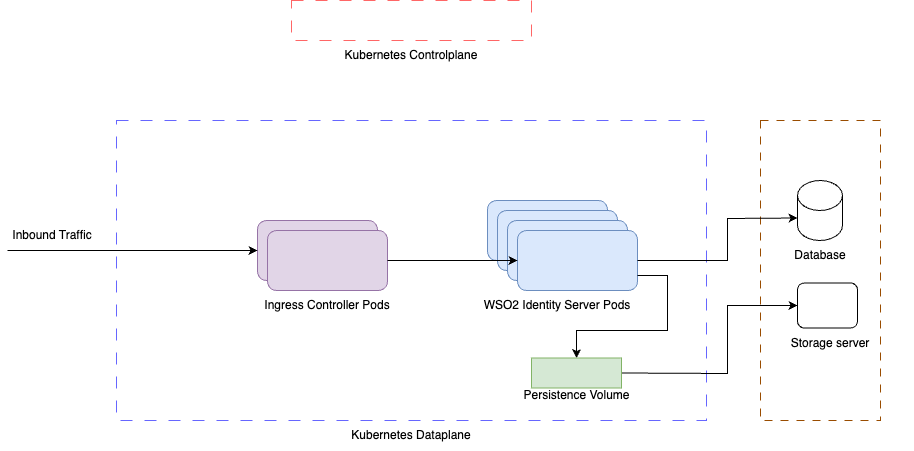

# WSO2 Identity Server

A Helm chart for WSO2 Identity server. This Helm chart can be used to deploy highly available and scalable WSO2 identity server deployment.

From this Helm chart, WSO2 Identity server pods are deployed and exposed through Kubernetes ingress resource. Also in advanced setup, you can configure, Kubernetes persistence volume for sharing runtime artifacts, Kubernetes secret provider class for securing secrets, Kubernetes horizontal pod autoscaling(HPA) and Kubernetes pod disruption budget(PDB). Additionally, pod affinity is configured to increase the high availability. 


___

## Required permission
User or service principle who installs the Helm chart, needs to possess actions `"create", "get", "list", "update", "delete"` on following K8s kinds,

| Kind                    | API Version                      |
|-------------------------|----------------------------------|
| ConfigMap               | v1                               |
| Deployment              | apps/v1                          |
| HorizontalPodAutoscaler | autoscaling/v1                   |
| Ingress                 | networking.k8s.io/v1             |
| PersistentVolume        | v1                               |
| PersistentVolumeClaim   | v1                               |
| PodDisruptionBudget     | policy/v1                        |
| Role                    | rbac.authorization.k8s.io/v1     |
| RoleBinding             | rbac.authorization.k8s.io/v1     |
| SecretProviderClass     | secrets-store.csi.x-k8s.io/v1    |
| Service                 | v1                               |
| ServiceAccount          | v1                               |
| Secret                  | v1                               |
| Route                   | route.openshift.io/v1            |
___

# Quick Start Guide

## Prerequisites

### Infrastructure
- Running Kubernetes cluster ([minikube](https://kubernetes.io/docs/tasks/tools/#minikube) or an alternative cluster)
- Kubernetes ingress controller ([NGINX Ingress](https://github.com/kubernetes/ingress-nginx) recommended)
- If you are deploying on OpenShift, ensure that you have administrative access to the cluster and the OpenShift CLI (oc) installed.

### Security
- AppArmor Security Module enabled

### Tools
| Tool          | Installation Guide | Version Check Command |
|---------------|--------------------|-----------------------|
| Git           | [Install Git](https://git-scm.com/book/en/v2/Getting-Started-Installing-Git) | `git --version` |
| Helm          | [Install Helm](https://helm.sh/docs/intro/install/) | `helm version` |
| Docker        | [Install Docker](https://docs.docker.com/engine/install/) | `docker --version` |
| kubectl       | [Install kubectl](https://kubernetes.io/docs/tasks/tools/#kubectl) | `kubectl version` |


## 1. Set up environment variables

Define environment variables for the Kubernetes namespace, and Helm release name.

```shell
export NAMESPACE=<Kubernetes Namespace to deploy the identity server resources>
export RELEASE_NAME=<Helm release name of the identity server deployment>
```


## 2. Create a Kubernetes namespace

Ensure that the specified namespace exists or create a new one using the following command.

```shell
kubectl get namespace $NAMESPACE || kubectl create namespace $NAMESPACE
```


## 3. Install the Helm chart

There are two ways to install the WSO2 Identity Server using the Helm chart.

### Option 1: Install the chart from the Helm repository
1. Add the WSO2 Helm chart repository

    Before installing WSO2 Identity Server, add the WSO2 Helm chart repository and update it to fetch the latest charts.

    ```shell
    helm repo add wso2 https://helm.wso2.com && helm repo update
    ```

2. Install the Helm chart from the Helm repository.
    ```shell
    helm install $RELEASE_NAME wso2/identity-server --version 7.1.0-1 \
    -n $NAMESPACE \
    --set deployment.image.registry="wso2"
    ```

    **Note:** To disable AppArmor, set --set deployment.apparmor.enabled="false" (default: true)

### Option 2: Install the Chart from source

If you prefer to build the chart from the source, follow the steps below:

1. Clone the WSO2 Kubernetes repository.

    ```shell
    git clone https://github.com/wso2/kubernetes-is.git
    cd kubernetes-is
    ```

    **Note:** You can customize the product configuration by modifying the `kubernetes-is/confs/deployment.toml` file after cloning the repository.

2. Install the Helm chart from the cloned repository:

    ```shell
    helm install $RELEASE_NAME -n $NAMESPACE . \
    --set deployment.image.registry="wso2"
    ```

    **Note:** 
    - To disable AppArmor, set --set deployment.apparmor.enabled="false" (default: true)
    - The above commands use the publicly released [WSO2 Identity Server Docker image](https://hub.docker.com/r/wso2/wso2is). To use a custom docker image, update the registry, repository, and tag accordingly. You can also specify an image digest instead of a tag as shown below:
    
        ```shell
        --set deployment.image.digest=<digest> 
        ```

#### Note: If you are using OpenShift, you need to set the following additional parameters:

To deploy WSO2 Identity Server on OpenShift, you need to create a compatible Docker image with the nessary configurations. The official WSO2 Identity Server Docker image is not OpenShift compatible by default, so you need to build a custom image by changing the group ownership of the product files to GID 0.
This is necessary because OpenShift runs containers with an arbitrary non-root user by default from the root user group, and the WSO2 Identity Server image needs to be able to access the files.

If you are using a custom image, you can set the following parameters to set an arbitrary UID.
```bash
--set deployment.securityContext.runAsUser.enabled=false \
--set deployment.apparmor.enabled=false \
--set deployment.entrypoint.defaultMode=0457
```

If you need to disable Seccomp and AppArmor and run with any UID, set the following:
```bash
oc adm policy add-scc-to-user anyuid -z <service-acccount-name> -n <namespace>
```

```bash
--set deployment.securityContext.seccompProfile.enabled=false \
--set deployment.apparmor.enabled=false
```

## 4. Enable routes for OpenShift deployment (If you are using Kubernetes instead of OpenShift, skip this step)
If you are deploying on OpenShift, you can enable routes for the WSO2 Identity Server deployment. You can do this by setting the following command:

```bash
--set deployment.route.enabled=true
```

## 5. Obtain the External IP

After deploying WSO2 Identity Server, you need to find its external IP address to access it outside the cluster. Run the following command to list the Ingress resources in your namespace:

```shell
kubectl get ing -n $NAMESPACE
```

**Output Fields:**

- **HOSTS** – Hostname (e.g., `wso2is.com`)
- **ADDRESS** – External IP
- **PORTS** – Exposed ports (usually 80, 443)

## 6. Configure DNS

If your hostname is backed by a DNS service, create a DNS record that maps the hostname to the external IP. If there is no DNS service, you can manually add an entry to the `/etc/hosts` file on your local machine (for evaluation purposes only):

```shell
<EXTERNAL-IP> wso2is.com
```

## 7. Access WSO2 Identity Server

Once everything is set up, you can access WSO2 Identity Server using the following URLs and credentials:

- Console: https://wso2is.com/console
- My Account portal: https://wso2is.com/myaccount


**Default credentials:**

- Username: `admin`
- Password: `admin`

Congratulations! You have successfully deployed WSO2 Identity Server on Kubernetes using Helm.

# Advance setup

## Install Helm chart on Azure Kubernetes service(AKS)

### Prerequisites
* [Azure Kubernetes Service(AKS) with ACR integration](https://learn.microsoft.com/en-us/azure/aks/cluster-container-registry-integration?tabs=azure-cli).
* Kubernetes ingress controller. Default integration is [Kubernetes Nginx ingress controller](https://github.com/kubernetes/ingress-nginx).
* [Secrets Store CSI Driver](https://secrets-store-csi-driver.sigs.k8s.io/introduction) and [secrets-store-csi-driver-provider-azure](https://github.com/Azure/secrets-store-csi-driver-provider-azure) to integrate secure vault.
* If artifact persistence is enabled; [Azure Storage account](https://learn.microsoft.com/en-us/azure/aks/azure-csi-files-storage-provision) to cater persistence volume type `ReadWriteMany` [access mode](https://kubernetes.io/docs/concepts/storage/persistent-volumes/#access-modes) and a share `is-share` under the Azure storage account.
* [Azure Key Vault](https://learn.microsoft.com/en-us/azure/key-vault/general/overview) to integrate secure vault.
* Pre-configured RDBMS. Please refer to [documentation](https://is.docs.wso2.com/en/latest/deploy/set-up-separate-databases-for-clustering/#!) on setting up databases. In the following guide uses Azure MSQL database server.
* [Azure container registry](https://azure.microsoft.com/en-us/products/container-registry) where the identity server Docker image is hosted.

> To set up the infrastructure layer you can use [WSO2 Terraform modules](https://github.com/wso2/iac-azure-wso2-products) 
---


## 1. Set up environment variables

Define environment variables for the Kubernetes namespace, Helm release name, and WSO2 subscription.

```shell
export NAMESPACE=<Kubernetes Namespace to deploy the identity server resources>
export RELEASE_NAME=<Helm release name of the identity server deployment>
export WSO2_USERNAME=<WSO2 subscription account username>
export WSO2_PASSWORD=<WSO2 subscription account password>
```


## 2. Create a Kubernetes namespace

Ensure that the specified namespace exists or create a new one using the following command.

```shell
kubectl get namespace $NAMESPACE || kubectl create namespace $NAMESPACE
```

    
## 3. Create a Kubernetes TLS secret 

For this you need possess the SSL certificate and the key.

```shell
kubectl create secret tls is-tls \
--cert=path/to/cert/file \
--key=path/to/key/file \
-n $NAMESPACE
```

**Note:**
- Ensure the certificate includes `localhost` as a Subject Alternative Name (SAN).

   
## 4. Create Kubernetes Secret for Java Keystore Files

The deployment requires the following Java keystore files:

| File                   | Purpose                                                                 |
|------------------------|-------------------------------------------------------------------------|
| `internal.p12`         | Used for internal data encryption/decryption                           |
| `primary.p12`          | Used for signing messages (e.g., SAML, OIDC)                            |
| `tls.p12`              | Used for TLS communication                                              |
| `client-truststore.p12`| Stores trusted certificates of external systems                         |


```shell
kubectl create secret generic keystores \
--from-file=path/to/internal_keystore(internal.p12) \
--from-file=path/to/primary_keystore(primary.p12) \
--from-file=path/to/tls_keystore(tls.p12) \
--from-file=path/to/client_truststore(client-truststore.p12) \
-n $NAMESPACE
```

**Note:**
- Make sure to import the public key certificates of all three keystores into the truststore (client-truststore.p12).
- Ensure that the tls.p12 used here matches the one used for creating the **is-tls** TLS kubernetes secret above.
- To create these keystores and truststores, refer to the official guide:  
👉 [How to Create New Keystores](https://is.docs.wso2.com/en/latest/deploy/security/keystores/create-new-keystores/)


## 5. Create Azure storage account secret

Create [Azure storage account secret](https://learn.microsoft.com/en-us/azure/aks/azure-csi-files-storage-provision#create-a-kubernetes-secret) for persistence volume.
     
```shell
export AZURE_STORAGE_NAME='<AZURE_STORAGE_NAME>'
export AZURE_STORAGE_KEY='<AZURE_STORAGE_KEY>'
```

Replace `<AZURE_STORAGE_NAME>` with Azure storage account name and `<AZURE_STORAGE_KEY>` with Azure storage account access key.

```shell
kubectl create secret generic azure-storage-csi \
--from-literal=azurestorageaccountname="${AZURE_STORAGE_NAME}" \
--from-literal=azurestorageaccountkey="${AZURE_STORAGE_KEY}" \
-n ${NAMESPACE}
```


## 6. Configure Azure key vault 
 
- Add `internal.p12` keystore password as the secret with the name `INTERNAL-KEYSTORE-PASSWORD-DECRYPTED`. 

- Replace: 
    - `<AZURE_KEY_VAULT_NAME>` with Azure Key vault name 
    - `<AZURE_SUBSCRIPTION_ID>` with Azure subscription ID 
    - `<INTERNAL_KEYSTORE_PASSWORD_DECRYPTED>` with internal keystore (`internal.p12`) password.
    
    ```shell
    export AZURE_KEY_VAULT_NAME='<AZURE_KEY_VAULT_NAME>'
    export AZURE_SUBSCRIPTION_ID='<AZURE_SUBSCRIPTION_ID>'
    export INTERNAL_KEYSTORE_PASSWORD_DECRYPTED='<INTERNAL_KEYSTORE_PASSWORD_DECRYPTED>'
    ```

```shell
az login
az account set -s "${AZURE_SUBSCRIPTION_ID}"
az keyvault secret set --vault-name "${AZURE_KEY_VAULT_NAME}" --name "INTERNAL-KEYSTORE-PASSWORD-DECRYPTED" --value "${INTERNAL_KEYSTORE_PASSWORD_DECRYPTED}"
```

- Create a Kubernetes secret to hold service principal credentials to access keyvault for [secrets-store-csi-driver-provider-azure](https://azure.github.io/secrets-store-csi-driver-provider-azure/docs/configurations/identity-access-modes/service-principal-mode/). 

- Replace: 
    - `<AZURE_KEY_VAULT_SP_APP_ID>` with Azure active directory service principle application ID 
    - `<AZURE_KEY_VAULT_SP_APP_SECRET>` with Azure active directory service principle application secret
    
    ```shell
    export AZURE_KEY_VAULT_SP_APP_ID='<AZURE_KEY_VAULT_SP_APP_ID>'
    export AZURE_KEY_VAULT_SP_APP_SECRET='<AZURE_KEY_VAULT_SP_APP_SECRET>'
    ```

```shell
kubectl create secret generic azure-kv-secret-store-sp \
--from-literal=clientid="${AZURE_KEY_VAULT_SP_APP_ID}" \
--from-literal=clientsecret="${AZURE_KEY_VAULT_SP_APP_SECRET}" \
-n ${NAMESPACE}
```

## 7. Encrypt secrets using WSO2 secure vault encryption

Following set of secure vault encrypted secrets are required for the deployment, please follow the [guideline](https://is.docs.wso2.com/en/latest/deploy/security/encrypt-passwords-with-cipher-tool/) to encrypt secrets using WSO2 secure vault encryption. 
Make sure to use previously created `internal.p12` keystore for the WSO2 secure vault encryption.

```shell
export DATABASE_IDENTITY_ENCRYPTED_USER='<Identity database encrypted username>'
export DATABASE_IDENTITY_ENCRYPTED_PASSWORD='<Identity database encrypted user password>'
export DATABASE_SHARED_ENCRYPTED_USER='<Shared database encrypted username>'
export DATABASE_SHARED_ENCRYPTED_PASSWORD='<Shared database encrypted user password>'
export DATABASE_USER_ENCRYPTED_USER='<User database encrypted username>'
export DATABASE_USER_ENCRYPTED_PASSWORD='<User database encrypted user password>'
export DATABASE_CONSENT_ENCRYPTED_USER='<Consent database encrypted username>'
export DATABASE_CONSENT_ENCRYPTED_PASSWORD='<Consent database encrypted user password>'
export KEYSTORE_INTERNAL_ENCRYPTED_PASSWORD='<Internal key store encrypted password>'
export KEYSTORE_INTERNAL_ENCRYPTED_KEY_PASSWORD='<Internal key store key encrypted password>'
export KEYSTORE_PRIMARY_ENCRYPTED_PASSWORD='<Primary key store encrypted password>'
export KEYSTORE_PRIMARY_ENCRYPTED_KEY_PASSWORD='<Primary key store key encrypted password>'
export KEYSTORE_TLS_ENCRYPTED_PASSWORD='<TLS key store encrypted password>'
export KEYSTORE_TLS_ENCRYPTED_KEY_PASSWORD='<TLS key store key encrypted password>'
export SUPER_ADMIN_ENCRYPTED_USERNAME='<Super admin user encrypted username>'
export SUPER_ADMIN_ENCRYPTED_PASSWORD='<Super admin user encrypted password>'
export TRUSTSTORE_ENCRYPTED_PASSWORD='<Client truststore encrypted password>'
export IDENTITY_AUTH_FRAMEWORK_ENDPOINT_ENCRYPTED_APP_PASSWORD='<Encrypted app password>'
export SYMMETRIC_ENCRYPTED_KEY='<Encrypted symmetric key>'
```

## 8. Install Helm chart

Add the WSO2 Helm chart repository.

```shell
helm repo add wso2 https://helm.wso2.com && helm repo update
```

Replace `<>` places holders with values as below,
 
* **<IMAGE_REGISTRY_HOSTNAME>**: Azure container register(ACR) hostname
* **<IMAGE_REPOSITORY_NAME>**: Azure container register(ACR) identity server image repository name
* **<IMAGE_DIGEST>**: Azure container register(ACR) identity server image digest
* **<AZURE_TENANT_ID>**: Azure tenant ID of Azure Key vault
* **<AZURE_KEY_VAULT_NAME>**: Azure Key vault name
* **<AZURE_KEY_VAULT_RG>**: Azure resource group name of Key vault
* **<AZURE_KEY_VAULT_SP_APP_ID>**: Azure application ID created under step 6
* **<DATABASE_IDENTITY_URL>**: Identity database JDBC URL
* **<DATABASE_SHARED_URL>**: Shared database JDBC URL
* **<DATABASE_USER_URL>**: User database JDBC URL
* **<DATABASE_CONSENT_URL>**: Consent database JDBC URL
* **<IS_HOSTNAME>**: Identity server public hostname
* **<ACCOUNT_RECOVERY_ENDPOINT_AUTH_HASH>**: Hash value of app password
* **<AZURE_SUBSCRIPTION_ID>**: Azure subscription ID
* **<RELEASE_NAME>**: Helm release name for the deployment

 ```shell
export IMAGE_REGISTRY_HOSTNAME='<IMAGE_REGISTRY_HOSTNAME>'
export IMAGE_REPOSITORY_NAME='<IMAGE_REPOSITORY_NAME>'
export IMAGE_DIGEST='<IMAGE_DIGEST>'
export AZURE_TENANT_ID='<AZURE_TENANT_ID>'
export AZURE_KEY_VAULT_NAME='<AZURE_KEY_VAULT_NAME>'
export AZURE_KEY_VAULT_RG='<AZURE_KEY_VAULT_RG>'
export AZURE_KEY_VAULT_SP_APP_ID='<AZURE_KEY_VAULT_SP_APP_ID>'
export DATABASE_IDENTITY_URL='<DATABASE_IDENTITY_URL>'
export DATABASE_SHARED_URL='<DATABASE_SHARED_URL>'
export DATABASE_USER_URL='<DATABASE_USER_URL>'
export DATABASE_CONSENT_URL='<DATABASE_CONSENT_URL>'
export IS_HOSTNAME='<IS_HOSTNAME>'
export ACCOUNT_RECOVERY_ENDPOINT_AUTH_HASH='<ACCOUNT_RECOVERY_ENDPOINT_AUTH_HASH>'
export NAMESPACE='<NAMESPACE>'
export AZURE_SUBSCRIPTION_ID='<AZURE_SUBSCRIPTION_ID>'
export RELEASE_NAME='<RELEASE_NAME>'
```

```shell
helm install "$RELEASE_NAME" wso2/identity-server --version 7.1.0-1  -n "$NAMESPACE" \
--set deployment.image.registry="${IMAGE_REGISTRY_HOSTNAME}" \
--set deployment.image.repository="${IMAGE_REPOSITORY_NAME}" \
--set deployment.image.digest="${IMAGE_DIGEST}" \
--set deployment.ingress.hostName="${IS_HOSTNAME}" \
--set deploymentToml.account.recovery.endpoint.auth.hash="${ACCOUNT_RECOVERY_ENDPOINT_AUTH_HASH}" \
--set deploymentToml.database.identity.url="${DATABASE_IDENTITY_URL}" \
--set deploymentToml.database.identity.driver="com.microsoft.sqlserver.jdbc.SQLServerDriver" \
--set deploymentToml.database.identity.type="mssql" \
--set deploymentToml.database.identity.username="${DATABASE_IDENTITY_ENCRYPTED_USER}" \
--set deploymentToml.database.identity.password="${DATABASE_IDENTITY_ENCRYPTED_PASSWORD}" \
--set deploymentToml.database.shared.url="${DATABASE_SHARED_URL}" \
--set deploymentToml.database.shared.driver="com.microsoft.sqlserver.jdbc.SQLServerDriver" \
--set deploymentToml.database.shared.type="mssql" \
--set deploymentToml.database.shared.username="${DATABASE_SHARED_ENCRYPTED_USER}" \
--set deploymentToml.database.shared.password="${DATABASE_SHARED_ENCRYPTED_PASSWORD}" \
--set deploymentToml.database.user.url="${DATABASE_USER_URL}" \
--set deploymentToml.database.user.driver="com.microsoft.sqlserver.jdbc.SQLServerDriver" \
--set deploymentToml.database.user.type="mssql" \
--set deploymentToml.database.user.username="${DATABASE_USER_ENCRYPTED_USER}" \
--set deploymentToml.database.user.password="${DATABASE_USER_ENCRYPTED_PASSWORD}" \
--set deploymentToml.database.consent.url="${DATABASE_CONSENT_URL}" \
--set deploymentToml.database.consent.driver="com.microsoft.sqlserver.jdbc.SQLServerDriver" \
--set deploymentToml.database.consent.type="msql" \
--set deploymentToml.database.consent.username="${DATABASE_CONSENT_ENCRYPTED_USER}" \
--set deploymentToml.database.consent.password="${DATABASE_CONSENT_ENCRYPTED_PASSWORD}" \
--set deployment.externalJKS.enabled=true \
--set deploymentToml.keystore.internal.fileName="internal.p12" \
--set deploymentToml.keystore.internal.password="${KEYSTORE_INTERNAL_ENCRYPTED_PASSWORD}" \
--set deploymentToml.keystore.internal.keyPassword="${KEYSTORE_INTERNAL_ENCRYPTED_KEY_PASSWORD}" \
--set deploymentToml.keystore.primary.fileName="primary.p12" \
--set deploymentToml.keystore.primary.password="${KEYSTORE_PRIMARY_ENCRYPTED_PASSWORD}" \
--set deploymentToml.keystore.primary.keyPassword="${KEYSTORE_PRIMARY_ENCRYPTED_KEY_PASSWORD}" \
--set deploymentToml.keystore.tls.fileName="tls.p12" \
--set deploymentToml.keystore.tls.password="${KEYSTORE_TLS_ENCRYPTED_PASSWORD}" \
--set deploymentToml.keystore.tls.keyPassword="${KEYSTORE_TLS_ENCRYPTED_KEY_PASSWORD}" \
--set deploymentToml.superAdmin.password="${SUPER_ADMIN_ENCRYPTED_PASSWORD}" \
--set deploymentToml.superAdmin.username="${SUPER_ADMIN_ENCRYPTED_USERNAME}" \
--set deploymentToml.truststore.password="${TRUSTSTORE_ENCRYPTED_PASSWORD}" \
--set deploymentToml.identity.authFramework.endpoint.appPassword="${IDENTITY_AUTH_FRAMEWORK_ENDPOINT_ENCRYPTED_APP_PASSWORD}" \
--set deploymentToml.encryption.key="${SYMMETRIC_ENCRYPTED_KEY}" \
--set deployment.secretStore.enabled=true \
--set deployment.secretStore.azure.keyVault.name="${AZURE_KEY_VAULT_NAME}" \
--set deployment.secretStore.azure.keyVault.resourceGroup="${AZURE_KEY_VAULT_RG}" \
--set deployment.secretStore.azure.keyVault.resourceGroup="${AZURE_KEY_VAULT_RG}" \
--set deployment.secretStore.azure.keyVault.servicePrincipalAppID="${AZURE_KEY_VAULT_SP_APP_ID}" \
--set deployment.secretStore.azure.keyVault.subscriptionId="${AZURE_SUBSCRIPTION_ID}" \
--set deployment.secretStore.azure.keyVault.tenantId="${AZURE_TENANT_ID}" \
--set deployment.persistence.enabled=true
```

 > If it is required to add additional configuration other than what are parameterised in `deployment.toml` file, you can override the Helm value `deploymentToml.extraConfigs`

## Compatibility

| Deployment | Version          | Helm Version | Compatibility Notes                  |
|------------|------------------|--------------|--------------------------------------|
| Kubernetes | v1.30.x          | v3.xx        | Fully compatible.                    |
| OpenShift  | v4.18.x          | v3.xx        | Fully compatible.                    |
| RKE2       | v1.31.8+rke2r1   | v3.xx        | Fully compatible.                    |

## Values


| Key | Type | Default | Description |
|-----|------|----|-------------|
| deployment.apparmor.profile | string | `"runtime/default"` | Apparmor profile |
| deployment.buildVersion | string | `"7.1.0"` | Product version |
| deployment.enableCorrelationLogs | bool | `false` | Enable correlation logs |
| deployment.externalJKS.enabled | bool | `false` | Mount external  keystore and trustores |
| deployment.externalJKS.secretName | string | `"keystores"` | K8s secret name which contains JKS files |
| deployment.extraVolumeMounts | list | `[]` | Additional volumeMounts to the pods. All the configuration mounts should be done under the path "/home/wso2carbon/wso2-config-volume/" |
| deployment.extraVolumes | list | `[]` | Additional volumes to the pod. |
| deployment.hpa.averageUtilizationCPU | int | `65` | Average CPU utilization for HPA |
| deployment.hpa.averageUtilizationMemory | int | `75` | averageUtilizationMemory parameter should be greater than 75 if not un expected scaling will happen during rolling update. |
| deployment.hpa.enabled | bool | `false` | Enable HPA for the deployment |
| deployment.hpa.maxReplicas | int | `2` | Max replica count for HPA(Ref: https://kubernetes.io/docs/tasks/run-application/horizontal-pod-autoscale/) |
| deployment.image.digest | string | `""` | Container image digest |
| deployment.image.imagePullSecret | string | `""` | image pull secret name |
| deployment.image.pullPolicy | string | `"Always"` | Refer to the Kubernetes documentation on updating images (Ref: https://kubernetes.io/docs/concepts/containers/images/#updating-images) |
| deployment.image.registry | string | `"docker.wso2.com"` | Container image registry host name |
| deployment.image.repository | string | `"wso2is"` | Container image repository name |
| deployment.image.tag | string | `"7.1.0"` | Container image tag. Either "tag" or "digest" should defined |
| deployment.ingress.annotations."nginx.ingress.kubernetes.io/affinity" | string | `"cookie"` |  |
| deployment.ingress.annotations."nginx.ingress.kubernetes.io/backend-protocol" | string | `"HTTPS"` |  |
| deployment.ingress.annotations."nginx.ingress.kubernetes.io/force-ssl-redirect" | string | `"true"` |  |
| deployment.ingress.annotations."nginx.ingress.kubernetes.io/proxy-buffer-size" | string | `"64k"` |  |
| deployment.ingress.annotations."nginx.ingress.kubernetes.io/proxy-buffering" | string | `"on"` |  |
| deployment.ingress.annotations."nginx.ingress.kubernetes.io/session-cookie-conditional-samesite-none" | string | `"true"` |  |
| deployment.ingress.annotations."nginx.ingress.kubernetes.io/session-cookie-hash" | string | `"sha1"` |  |
| deployment.ingress.annotations."nginx.ingress.kubernetes.io/session-cookie-name" | string | `"paf"` |  |
| deployment.ingress.annotations."nginx.ingress.kubernetes.io/session-cookie-path" | string | `"/"` |  |
| deployment.ingress.annotations."nginx.ingress.kubernetes.io/session-cookie-samesite" | string | `"None"` |  |
| deployment.ingress.enableNginxRateLimit | bool | `false` | Enable Nginx rate limiting |
| deployment.ingress.hostName | string | `"wso2is.com"` | Host name of the Identity server as Key Manager |
| deployment.ingress.ingressClassName | string | `"nginx"` | Ingress class name |
| deployment.ingress.tlsSecretsName | string | `"is-tls"` | K8s TLS secret for configured hostname |
| deployment.livenessProbe | object | `{"periodSeconds":10}` | Indicates whether the container is running |
| deployment.livenessProbe.periodSeconds | int | `10` | How often (in seconds) to perform the probe |
| deployment.pdb.minAvailable | string | `"50%"` | Minimum availability for PDB |
| deployment.persistence.azure.enabled | bool | `true` | Enable persistence for artifact sharing using Azure file share |
| deployment.persistence.azure.fileShare | string | `"is-share"` | Names of Azure File shares for persisted data |
| deployment.persistence.azure.secretName | string | `"azure-storage-csi"` | K8s secret name for the Azure file share CI driver  |
| deployment.persistence.capacity | string | `"100Gi"` | Define capacity for persistent runtime artifacts which are shared between instances of the Identity Server profile |
| deployment.persistence.enabled | bool | `false` | Enable persistence for artifact sharing |
| deployment.persistence.subPaths.tenants | string | `"tenants"` | Azure storage account tenants file share path |
| deployment.persistence.subPaths.userstores | string | `"userstores"` | Azure storage account userstores file share path |
| deployment.preStopHookWaitSeconds | int | `10` | preStopHookWaitInSeconds waits before calling server stop in the pre stop hook. |
| deployment.productPackName | string | `"wso2is"` | Product pack name |
| deployment.progressDeadlineSeconds | int | `600` | Progress deadline seconds where the Deployment controller waits before indicating (in the Deployment status) that the Deployment progress has stalled. |
| deployment.readinessProbe | object | `{"initialDelaySeconds":60,"periodSeconds":10}` | Indicates whether the container is ready to service requests |
| deployment.readinessProbe.initialDelaySeconds | int | `60` | Number of seconds after the container has started before readiness probes are initiated |
| deployment.readinessProbe.periodSeconds | int | `10` | How often (in seconds) to perform the probe |
| deployment.replicas | int | `1` | Number of deployment replicas |
| deployment.resources.jvm.javaOpts | string | `"-Djdk.tls.ephemeralDHKeySize=2048 -Djdk.tls.rejectClientInitiatedRenegotiation=true -Dhttpclient.hostnameVerifier=Strict -Djdk.tls.client.protocols=TLSv1.2 -Djava.util.prefs.systemRoot=/home/wso2carbon/.java -Djava.util.prefs.userRoot=/home/wso2carbon/.java/.userPrefs"` | JVM parameters |
| deployment.resources.jvm.memOpts | string | `"-Xms2048m -Xmx2048m"` | JVM memory options |
| deployment.resources.limits.cpu | string | `"3"` | The maximum amount of CPU that should be allocated for a Pod |
| deployment.resources.limits.memory | string | `"4Gi"` | The maximum amount of memory that should be allocated for a Pod |
| deployment.resources.requests | object | `{"cpu":"2","memory":"2Gi"}` | as per official documentation (Ref: https://is.docs.wso2.com/en/latest/setup/installation-prerequisites/) |
| deployment.resources.requests.cpu | string | `"2"` | The minimum amount of CPU that should be allocated for a Pod |
| deployment.resources.requests.memory | string | `"2Gi"` | The minimum amount of memory that should be allocated for a Pod |
| deployment.route.enabled | bool | `false` | Enable OpenShift route |
| deployment.route.tls.termination.certificate | string | `""` | TLS certificate |
| deployment.route.tls.termination.key | string | `""` | TLS key |
| deployment.route.tls.termination.type | string | `"passthrough"` | TLS termination type |
| deployment.secretStore.azure.enabled | bool | `true` | Enable Azure Key Vault integration. |
| deployment.secretStore.azure.keyVault.name | string | `""` | Name of the target Azure Key Vault instance |
| deployment.secretStore.azure.keyVault.resourceGroup | string | `""` | Name of the Azure Resource Group to which the target Azure Key Vault belongs |
| deployment.secretStore.azure.keyVault.secretName | string | `"INTERNAL-KEYSTORE-PASSWORD-DECRYPTED"` | Azure Key Vault secret name of the internal keystore password |
| deployment.secretStore.azure.keyVault.servicePrincipalAppID | string | `""` | Service Principal created for transacting with the target Azure Key Vault Ref: https://github.com/Azure/secrets-store-csi-driver-provider-azure/blob/master/docs/service-principal-mode.md |
| deployment.secretStore.azure.keyVault.subscriptionId | string | `""` | Subscription ID of the target Azure Key Vault |
| deployment.secretStore.azure.keyVault.tenantId | string | `""` | Azure Active Directory tenant ID of the target Key Vault |
| deployment.secretStore.azure.nodePublishSecretRef | string | `"azure-kv-secret-store-sp"` | The name of the Kubernetes secret that contains the service principal credentials to access Azure Key Vault. Ref: https://azure.github.io/secrets-store-csi-driver-provider-azure/docs/configurations/identity-access-modes/service-principal-mode/#configure-service-principal-to-access-keyvault |
| deployment.secretStore.enabled | bool | `false` | Enable secure vault with secret store CSI driver |
| deployment.securityContext.enableRunAsUser | bool | `true` | Enable runAsUser security context |
| deployment.securityContext.enableRunAsGroup | bool | `false` | Enable runAsGroup security context |
| deployment.securityContext.runAsGroup | int | `802` | Run as group ID |
| deployment.securityContext.runAsUser | int | `802` | Run as user ID |
| deployment.securityContext.seccompProfile.type | string | `"RuntimeDefault"` | Seccomp profile type |
| deployment.securityContext.seLinux.enabled | bool | `false` | Enable SELinux |
| deployment.startupProbe | object | `{"failureThreshold":30,"initialDelaySeconds":60,"periodSeconds":5}` | Startup probe executed prior to Liveness Probe taking over |
| deployment.startupProbe.failureThreshold | int | `30` | Number of attempts |
| deployment.startupProbe.initialDelaySeconds | int | `60` | Number of seconds after the container has started before startup probes are initiated |
| deployment.startupProbe.periodSeconds | int | `5` | How often (in seconds) to perform the probe |
| deployment.strategy.rollingUpdate.maxSurge | int | `1` | The maximum number of pods that can be scheduled above the desired number of pods |
| deployment.strategy.rollingUpdate.maxUnavailable | int | `0` | The maximum number of pods that can be unavailable during the update |
| deployment.terminationGracePeriodSeconds | int | `40` | Pod termination grace period. K8s API server waits this period after pre stop hook and sending TERM signal |
| deploymentToml.account.recovery.endpoint.auth.hash | string | `"66cd9688a2ae068244ea01e70f0e230f5623b7fa4cdecb65070a09ec06452262"` | Configure client authentication app password hash. Ref https://is.docs.wso2.com/en/latest/deploy/security/product-level-security-guidelines/#configure-client-authentication |
| deploymentToml.clustering.domain | string | `"wso2.is.domain"` | Cluster domain |
| deploymentToml.clustering.enabled | bool | `true` | Enable clustering. Ref: https://is.docs.wso2.com/en/latest/deploy/configure-hazelcast/ |
| deploymentToml.clustering.localMemberPort | string | `"4001"` | This defines local member port |
| deploymentToml.clustering.membershipScheme | string | `"kubernetes"` | This defines membership schema type |
| deploymentToml.database.consent.driver | string | `"org.h2.Driver"` | The database JDBC driver |
| deploymentToml.database.consent.password | string | `"wso2carbon"` | The database password |
| deploymentToml.database.consent.poolOptions | string | `nil` | The database pool options |
| deploymentToml.database.consent.type | string | `"h2"` | The SQL server type(ex: mysql, mssql) |
| deploymentToml.database.consent.url | string | `"jdbc:h2:./repository/database/WSO2IDENTITY_DB;DB_CLOSE_ON_EXIT=FALSE"` | The database JDBC URL |
| deploymentToml.database.consent.username | string | `"wso2carbon"` | The database username |
| deploymentToml.database.identity.driver | string | `"org.h2.Driver"` | The database JDBC driver |
| deploymentToml.database.identity.password | string | `"wso2carbon"` | The password |
| deploymentToml.database.identity.poolOptions | string | `nil` | The database pool options |
| deploymentToml.database.identity.type | string | `"h2"` | The SQL server type(ex: mysql, mssql) |
| deploymentToml.database.identity.url | string | `"jdbc:h2:./repository/database/WSO2IDENTITY_DB;DB_CLOSE_ON_EXIT=FALSE"` | The database JDBC URL |
| deploymentToml.database.identity.username | string | `"wso2carbon"` | The database username |
| deploymentToml.database.shared.driver | string | `"org.h2.Driver"` | The database JDBC driver |
| deploymentToml.database.shared.password | string | `"wso2carbon"` | The database password |
| deploymentToml.database.shared.poolOptions | string | `nil` | The database pool options |
| deploymentToml.database.shared.type | string | `"h2"` | The SQL server type(ex: mysql, mssql) |
| deploymentToml.database.shared.url | string | `"jdbc:h2:./repository/database/WSO2SHARED_DB;DB_CLOSE_ON_EXIT=FALSE;LOCK_TIMEOUT=60000"` | The database JDBC URL |
| deploymentToml.database.shared.username | string | `"wso2carbon"` | The database username |
| deploymentToml.database.user.driver | string | `"org.h2.Driver"` | The database JDBC driver |
| deploymentToml.database.user.password | string | `"wso2carbon"` | The database password |
| deploymentToml.database.user.poolOptions | string | `nil` | The database pool options |
| deploymentToml.database.user.type | string | `"h2"` | The SQL server type(ex: mysql, mssql) |
| deploymentToml.database.user.url | string | `"jdbc:h2:./repository/database/WSO2SHARED_DB;DB_CLOSE_ON_EXIT=FALSE;LOCK_TIMEOUT=60000"` | The database JDBC URL |
| deploymentToml.database.user.username | string | `"wso2carbon"` | The database username |
| deploymentToml.encryption.key | string | `"3cc0481b70794667b5bee7e2beed2de4"` | Configure symmetric key encryption key. Ref https://is.docs.wso2.com/en/latest/deploy/security/symmetric-encryption/use-symmetric-encryption/ |
| deploymentToml.extraConfigs | string | `nil` | Add custom configurations to deployment.toml. |
| deploymentToml.identity.authFramework.endpoint.appPassword | string | `"dashboard"` | Configure client authentication encrypted app password. Ref https://is.docs.wso2.com/en/latest/deploy/security/product-level-security-guidelines/#configure-client-authentication |
| deploymentToml.keystore.internal.alias | string | `"wso2carbon"` |  |
| deploymentToml.keystore.internal.fileName | string | `"wso2carbon.p12"` |  |
| deploymentToml.keystore.internal.keyPassword | string | `"wso2carbon"` |  |
| deploymentToml.keystore.internal.password | string | `"wso2carbon"` |  |
| deploymentToml.keystore.internal.type | string | `"PKCS12"` |  |
| deploymentToml.keystore.primary.alias | string | `"wso2carbon"` |  |
| deploymentToml.keystore.primary.fileName | string | `"wso2carbon.p12"` |  |
| deploymentToml.keystore.primary.keyPassword | string | `"wso2carbon"` |  |
| deploymentToml.keystore.primary.password | string | `"wso2carbon"` |  |
| deploymentToml.keystore.primary.type | string | `"PKCS12"` |  |
| deploymentToml.keystore.tls.alias | string | `"wso2carbon"` |  |
| deploymentToml.keystore.tls.fileName | string | `"wso2carbon.p12"` |  |
| deploymentToml.keystore.tls.keyPassword | string | `"wso2carbon"` |  |
| deploymentToml.keystore.tls.password | string | `"wso2carbon"` |  |
| deploymentToml.keystore.tls.type | string | `"PKCS12"` |  |
| deploymentToml.oauth.tokenCleanup | bool | `false` | Enable/Disable the internal token cleanup process. Ref: https://is.docs.wso2.com/en/6.0.0/deploy/remove-unused-tokens-from-the-database/#! |
| deploymentToml.oauth.tokenGeneration.includeUsernameInAccessToken | bool | `false` | Add UserName Assertions in Access Tokens. Ref: https://is.docs.wso2.com/en/6.0.0/deploy/enable-assertions-in-access-tokens/ |
| deploymentToml.otp.email.addressRequestPage | string | `"https://localhost:9443/emailotpauthenticationendpoint/emailAddress.jsp"` |  |
| deploymentToml.otp.email.authenticationEndpointErrorPage | string | `"https://localhost:9443/emailotpauthenticationendpoint/emailotpError.jsp"` | Error page that will be displayed in case of an authentication failure. |
| deploymentToml.otp.email.authenticationEndpointURL | string | `"https://localhost:9443/emailotpauthenticationendpoint/emailotp.jsp"` | Authentication endpoint URL of the authenticator. |
| deploymentToml.otp.email.captureAndUpdateEmailAddress | bool | `true` |  |
| deploymentToml.otp.email.emailAddressRegex | string | `"(?&lt;=.{1}).(?=.*@)"` |  |
| deploymentToml.otp.email.enableByUserClaim | bool | `true` |  |
| deploymentToml.otp.email.enabled | bool | `false` | Enable email OTP. Ref: https://is.docs.wso2.com/en/latest/guides/mfa/email-otp-config-advanced/#email-otp-configurations |
| deploymentToml.otp.email.federatedEmailAttributeKey | string | `"email"` |  |
| deploymentToml.otp.email.mandatory | bool | `false` | This parmeter defines whether email OTP is enforced as the second step of the 2FA/MFA or not. |
| deploymentToml.otp.email.secondaryUserstore | string | `"primary"` | You can define multiple user stores per tenant as comma separated values. |
| deploymentToml.otp.email.sendOTPToFederatedEmailAttribute | bool | `false` |  |
| deploymentToml.otp.email.showEmailAddressInUI | bool | `true` |  |
| deploymentToml.otp.email.tokenExpirationTime | int | `300000` |  |
| deploymentToml.otp.email.useEventHandlerBasedEmailSender | bool | `true` |  |
| deploymentToml.otp.email.usecase | string | `"local"` | This parameter defines how the email ID will be retrieved. |
| deploymentToml.otp.email.userAccountLockEnabled | bool | `false` | Enable account locking by email OTP. Ref: https://is.docs.wso2.com/en/latest/guides/identity-lifecycles/lock-accounts-by-failed-otp-attempts/ |
| deploymentToml.otp.sms.authenticationEndpointErrorPage | string | `"/smsotpauthenticationendpoint/smsotpError.jsp"` |  |
| deploymentToml.otp.sms.authenticationEndpointURL | string | `"/smsotpauthenticationendpoint/smsotp.jsp"` |  |
| deploymentToml.otp.sms.backupCode | bool | `true` |  |
| deploymentToml.otp.sms.captureAndUpdateMobileNumber | bool | `true` |  |
| deploymentToml.otp.sms.directlyToMobile | bool | `false` |  |
| deploymentToml.otp.sms.enableByUserClaim | bool | `true` |  |
| deploymentToml.otp.sms.enabled | bool | `false` | Enable SMS OTP. Ref: https://is.docs.wso2.com/en/latest/guides/mfa/sms-otp-config-advanced/ |
| deploymentToml.otp.sms.federatedMobile | bool | `false` |  |
| deploymentToml.otp.sms.federatedMobileAttributeKey | string | `"mobile"` |  |
| deploymentToml.otp.sms.mandatory | bool | `false` |  |
| deploymentToml.otp.sms.mobileNumberRegPage | string | `"/smsotpauthenticationendpoint/mobile.jsp"` |  |
| deploymentToml.otp.sms.redirectToMultiOptionPageOnFailure | bool | `false` |  |
| deploymentToml.otp.sms.resendEnable | bool | `true` |  |
| deploymentToml.otp.sms.retryEnable | bool | `true` |  |
| deploymentToml.otp.sms.secondaryUserstore | string | `"primary"` |  |
| deploymentToml.otp.sms.usecase | string | `"local"` |  |
| deploymentToml.otp.sms.userAccountLockEnabled | bool | `false` | Enable account locking by email OTP. Ref: https://is.docs.wso2.com/en/latest/guides/identity-lifecycles/lock-accounts-by-failed-otp-attempts/ |
| deploymentToml.outputAdapter.email.enableAuthentication | bool | `true` |  |
| deploymentToml.outputAdapter.email.enableStartTls | bool | `true` |  |
| deploymentToml.outputAdapter.email.enabled | bool | `false` | Enable the email sender. Ref: https://is.docs.wso2.com/en/latest/deploy/configure-email-sending/#configure-the-email-sender-globally |
| deploymentToml.outputAdapter.email.fromAddress | string | `""` |  |
| deploymentToml.outputAdapter.email.hostname | string | `""` |  |
| deploymentToml.outputAdapter.email.password | string | `""` |  |
| deploymentToml.outputAdapter.email.port | int | `587` |  |
| deploymentToml.outputAdapter.email.username | string | `""` |  |
| deploymentToml.recaptcha.apiUrl | string | `""` |  |
| deploymentToml.recaptcha.enabled | bool | `false` | Enable reCAPTCHA. Ref: https://is.docs.wso2.com/en/latest/deploy/configure-recaptcha/ |
| deploymentToml.recaptcha.secretKey | string | `""` |  |
| deploymentToml.recaptcha.siteKey | string | `""` |  |
| deploymentToml.recaptcha.verifyUrl | string | `""` |  |
| deploymentToml.server.offset | string | `"0"` | Change default ports(Ref: https://is.docs.wso2.com/en/latest/references/default-ports-of-wso2-products/#:~:text=For%20each%20additional%20WSO2%20product,to%20the%20server%20during%20startup.) |
| deploymentToml.superAdmin.createAdminAccount | bool | `true` | Create Carbon console admin account |
| deploymentToml.superAdmin.password | string | `"admin"` | Carbon console admin account password |
| deploymentToml.superAdmin.username | string | `"admin"` | Carbon console admin account username |
| deploymentToml.totp.authenticationEndpointEnableTOTPPage | string | `"authenticationendpoint/totp_enroll.do"` |  |
| deploymentToml.totp.authenticationEndpointErrorPage | string | `"authenticationendpoint/totp_error.do"` |  |
| deploymentToml.totp.authenticationEndpointURL | string | `"authenticationendpoint/totp.do"` |  |
| deploymentToml.totp.authenticationMandatory | bool | `true` |  |
| deploymentToml.totp.enabled | bool | `false` |  |
| deploymentToml.totp.encodingMethod | string | `"Base32"` |  |
| deploymentToml.totp.enrolUserInAuthenticationFlow | bool | `true` |  |
| deploymentToml.totp.issuer | string | `"WSO2"` |  |
| deploymentToml.totp.secondaryUserstore | string | `"primary"` |  |
| deploymentToml.totp.timeStepSize | string | `"30"` |  |
| deploymentToml.totp.useCommonIssuer | bool | `true` |  |
| deploymentToml.totp.usecase | string | `"local"` |  |
| deploymentToml.totp.userAccountLockEnabled | bool | `false` | Enable account locking by OTP. Ref: https://is.docs.wso2.com/en/latest/guides/identity-lifecycles/lock-accounts-by-failed-otp-attempts/ |
| deploymentToml.totp.windowSize | string | `"3"` |  |
| deploymentToml.transport.https.properties.server | string | `"WSO2 Carbon Server"` | Server name in HTTP response headers. Ref: https://is.docs.wso2.com/en/latest/deploy/security/configure-transport-level-security/#change-the-server-name-in-http-response-headers |
| deploymentToml.transport.https.sslHostConfig.properties.ciphers | string | `"TLS_ECDHE_ECDSA_WITH_AES_256_GCM_SHA384, TLS_ECDHE_ECDSA_WITH_AES_128_GCM_SHA256, TLS_ECDHE_RSA_WITH_AES_256_GCM_SHA384, TLS_ECDH_ECDSA_WITH_AES_256_GCM_SHA384, TLS_DHE_DSS_WITH_AES_256_GCM_SHA384, TLS_ECDH_RSA_WITH_AES_256_GCM_SHA384, TLS_ECDHE_RSA_WITH_AES_128_GCM_SHA256, TLS_ECDH_ECDSA_WITH_AES_128_GCM_SHA256, TLS_ECDH_RSA_WITH_AES_128_GCM_SHA256, TLS_DHE_DSS_WITH_AES_128_GCM_SHA256, TLS_ECDHE_ECDSA_WITH_AES_256_CBC_SHA384, TLS_ECDH_ECDSA_WITH_AES_256_CBC_SHA384, TLS_ECDH_RSA_WITH_AES_256_CBC_SHA384, TLS_ECDHE_RSA_WITH_AES_256_CBC_SHA384, TLS_DHE_DSS_WITH_AES_256_CBC_SHA256, TLS_ECDHE_ECDSA_WITH_AES_256_CBC_SHA, TLS_ECDH_ECDSA_WITH_AES_256_CBC_SHA, TLS_ECDH_RSA_WITH_AES_256_CBC_SHA, TLS_DHE_DSS_WITH_AES_256_CBC_SHA, TLS_ECDHE_ECDSA_WITH_AES_128_CBC_SHA256, TLS_ECDH_ECDSA_WITH_AES_128_CBC_SHA256, TLS_ECDH_RSA_WITH_AES_128_CBC_SHA256, TLS_DHE_DSS_WITH_AES_128_CBC_SHA256, TLS_ECDHE_ECDSA_WITH_AES_128_CBC_SHA, TLS_ECDH_ECDSA_WITH_AES_128_CBC_SHA, TLS_ECDH_RSA_WITH_AES_128_CBC_SHA, TLS_DHE_DSS_WITH_AES_128_CBC_SHA, TLS_EMPTY_RENEGOTIATION_INFO_SCSVF"` | Configure TSL ciphers in the HTTPS transport. Ref: https://is.docs.wso2.com/en/latest/deploy/security/configure-transport-level-security/#disable-weak-ciphers |
| deploymentToml.transport.https.sslHostConfig.properties.protocols | string | `"+TLSv1, +TLSv1.1, +TLSv1.2, +TLSv1.3"` | Enabling SSL protocols in the HTTPS transport. Ref: https://is.docs.wso2.com/en/latest/deploy/security/configure-transport-level-security/#enabling-ssl-protocols-in-the-wso2-is |
| deploymentToml.transport.thrift.ciphers | string | `"TLS_ECDHE_ECDSA_WITH_AES_256_GCM_SHA384,TLS_ECDHE_ECDSA_WITH_AES_128_GCM_SHA256,TLS_ECDHE_RSA_WITH_AES_256_GCM_SHA384,TLS_ECDH_ECDSA_WITH_AES_256_GCM_SHA384,TLS_DHE_DSS_WITH_AES_256_GCM_SHA384,TLS_ECDH_RSA_WITH_AES_256_GCM_SHA384,TLS_ECDHE_RSA_WITH_AES_128_GCM_SHA256,TLS_ECDH_ECDSA_WITH_AES_128_GCM_SHA256,TLS_ECDH_RSA_WITH_AES_128_GCM_SHA256,TLS_DHE_DSS_WITH_AES_128_GCM_SHA256,TLS_ECDHE_ECDSA_WITH_AES_256_CBC_SHA384,TLS_ECDH_ECDSA_WITH_AES_256_CBC_SHA384,TLS_ECDH_RSA_WITH_AES_256_CBC_SHA384,TLS_ECDHE_RSA_WITH_AES_256_CBC_SHA384,TLS_DHE_DSS_WITH_AES_256_CBC_SHA256,TLS_ECDHE_ECDSA_WITH_AES_256_CBC_SHA,TLS_ECDH_ECDSA_WITH_AES_256_CBC_SHA,TLS_ECDH_RSA_WITH_AES_256_CBC_SHA,TLS_DHE_DSS_WITH_AES_256_CBC_SHA,TLS_ECDHE_ECDSA_WITH_AES_128_CBC_SHA256,TLS_ECDH_ECDSA_WITH_AES_128_CBC_SHA256,TLS_ECDH_RSA_WITH_AES_128_CBC_SHA256,TLS_DHE_DSS_WITH_AES_128_CBC_SHA256,TLS_ECDHE_ECDSA_WITH_AES_128_CBC_SHA,TLS_ECDH_ECDSA_WITH_AES_128_CBC_SHA,TLS_ECDH_RSA_WITH_AES_128_CBC_SHA,TLS_DHE_DSS_WITH_AES_128_CBC_SHA"` | Configure TSL ciphers in ThriftAuthenticationService. Ref: https://is.docs.wso2.com/en/latest/deploy/security/configure-transport-level-security/#enable-ssl-protocols-and-ciphers-in-thriftauthenticationservice |
| deploymentToml.transport.thrift.protocols | string | `"TLSv1,TLSv1.1,TLSv1.2"` | Enabling SSL protocols in ThriftAuthenticationService. Ref: https://is.docs.wso2.com/en/latest/deploy/security/configure-transport-level-security/#enable-ssl-protocols-and-ciphers-in-thriftauthenticationservice |
| deploymentToml.truststore.fileName | string | `"client-truststore.p12"` |  |
| deploymentToml.truststore.password | string | `"wso2carbon"` |  |
| deploymentToml.truststore.type | string | `"PKCS12"` |  |
| deploymentToml.userAccountLock.enabled | bool | `true` | Enable user account lock. Ref: https://is.docs.wso2.com/en/latest/guides/identity-lifecycles/lock-account/ |
| deploymentToml.userAccountLock.loginAttempts.allowedFailedAttempts | int | `5` | This indicates the number of consecutive attempts that a user can try to log in without the account getting locked. If the value you specify is 2, the account gets locked if the login attempt fails twice. |
| deploymentToml.userAccountLock.loginAttempts.autoUnlockAfter | int | `5` | The time specified here is in minutes. Authentication can be attempted once this time has passed. |
| deploymentToml.userAccountLock.loginAttempts.autoUnlockTimeIncrementRatio | int | `2` | This indicates how much the account unlock timeout is incremented by after each failed login attempt |
| deploymentToml.userStore.type | string | `"database_unique_id"` |  |
| k8sKindAPIVersions | object | `{"configMap":"v1","deployment":"apps/v1","horizontalPodAutoscaler":"autoscaling/v1","ingress":"networking.k8s.io/v1","persistentVolume":"v1","persistentVolumeClaim":"v1","podDisruptionBudget":"policy/v1","role":"rbac.authorization.k8s.io/v1","roleBinding":"rbac.authorization.k8s.io/v1","secret":"v1","secretProviderClass":"secrets-store.csi.x-k8s.io/v1","service":"v1","serviceAccount":"v1"}` | K8s API versions for K8s kinds |
| k8sKindAPIVersions.configMap | string | `"v1"` | K8s API version for kind ConfigMap |
| k8sKindAPIVersions.deployment | string | `"apps/v1"` | K8s API version for kind Deployment |
| k8sKindAPIVersions.horizontalPodAutoscaler | string | `"autoscaling/v1"` | K8s API version for kind HorizontalPodAutoscaler |
| k8sKindAPIVersions.ingress | string | `"networking.k8s.io/v1"` | K8s API version for kind Ingress |
| k8sKindAPIVersions.persistentVolume | string | `"v1"` | K8s API version for kind PersistentVolume |
| k8sKindAPIVersions.persistentVolumeClaim | string | `"v1"` | K8s API version for kind PersistentVolumeClaim |
| k8sKindAPIVersions.podDisruptionBudget | string | `"policy/v1"` | K8s API version for kind PodDisruptionBudget |
| k8sKindAPIVersions.role | string | `"rbac.authorization.k8s.io/v1"` | K8s API version for kind Role |
| k8sKindAPIVersions.roleBinding | string | `"rbac.authorization.k8s.io/v1"` | K8s API version for kind RoleBinding |
| k8sKindAPIVersions.secret | string | `"v1"` | K8s API version for kind Secret |
| k8sKindAPIVersions.secretProviderClass | string | `"secrets-store.csi.x-k8s.io/v1"` | K8s API version for kind SecretProviderClass |
| k8sKindAPIVersions.service | string | `"v1"` | K8s API version for kind Service |
| k8sKindAPIVersions.serviceAccount | string | `"v1"` | K8s API version for kind ServiceAccount |
| openShiftKindAPIVersions.route | string | `"route.openshift.io/v1"` | OpenShift API version for kind Route |
| wso2.subscription.password | string | `""` | WSO2 account password |
| wso2.subscription.username | string | `""` | WSO2 account username |
