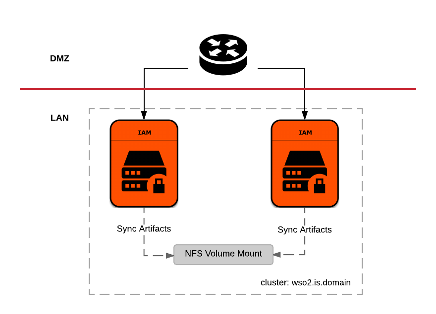

# WSO2 Identity Server Deployment Pattern-1 
WSO2 Identity Server pattern 1 runs two Identity Server replicas fronted with a load balancer. Identity Server 
nodes are clustered and a NFS volume mount is shared among nodes to synchronize runtime artifacts.



This deployment can be scaled into any `<n>` number of container replicas, upon your requirements.

>In the context of this document, `KUBERNETES_HOME` will refer to a local copy of 
[`wso2/kubernetes-is`](https://github.com/wso2/kubernetes-is/) git repository

## Prerequisites

Follow the guide in [`KUBERNETES_HOME/README.md`](../README.md) upto step 4.

## Deploy services

##### 1. Create configuration maps:
```
kubectl create configmap is-conf --from-file=conf/is/conf/
kubectl create configmap is-bin --from-file=conf/is/bin/
kubectl create configmap is-conf-datasources --from-file=conf/is/conf/datasources/
kubectl create configmap is-conf-identity --from-file=conf/is/conf/identity/
kubectl create configmap is-conf-axis2 --from-file=conf/is/conf/axis2/
kubectl create configmap is-conf-tomcat --from-file=conf/is/conf/tomcat/
kubectl create configmap mysql-conf --from-file=conf/mysql/conf/
kubectl create configmap mysql-initscripts --from-file=conf/mysql/initscripts/
kubectl create configmap mysql-dbscripts --from-file=conf/mysql/dbscripts
```
##### 2. Deploy and run MySQL service: 
```
kubectl create -f mysql-service.yaml
kubectl create -f mysql-deployment.yaml
```
> In the production environment ensure the high availability of the RDMS used. In this deployment only a one mysql 
container is used.
##### 3. Deploy and run WSO2 Identity Server service:
Update the ip address in `is-deployment.yaml` with your NFS server ip address. Give read and write permissions for user
 id , 1000000000 and group id 1000000000 for the mount directories in your NFS server.  
```
kubectl create -f is-service.yaml
kubectl create -f is-deployment.yaml
```
Note- In addition to the config maps mentioned in is-deployment.yaml. Two other config maps can be used to copy the 
relevant configuration files to `<IS_Home>` and `<IS_Home>/repository/conf/security`.

Those config maps should be mounted to paths `/home/wso2user/wso2is-5.5.0-conf/home` and  `/home/wso2user/wso2is-5.5
.0-conf/conf-security` respectively.

Due to known [issue](https://github.com/wso2/kubernetes-is/issues/7), after deploying 1st node, scale up the 
deployment to two nodes using following,

```
kubectl scale --replicas=2 -f is-deployment.yaml
```
##### 4. Deploy and run Nginx Ingress service:
Install ingress-controller and default-backend  using [this](https://kubernetes.github.io/ingress-nginx/deploy/)
```
kubectl create -f loadbalancer-secret.yaml
kubectl create -f is-ingress.yaml
```
##### 5. Access Management Console:
Deployment will expose a publicly accessible host, namely: `wso2is-pattern1`

To access the console in a test environment, add the above host as an entry in /etc/hosts file, pointing to <br> 
Nginx Ingress cluster IP and try navigating to `https://wso2is-pattern1/carbon` from <br>
your favorite browser.

##### 6. Scale up using `kubectl scale`:
Default deployment runs two replicas (or pods) of WSO2 Identity server. To scale this deployment into <br>
any `<n>` number of container replicas, upon your requirement, simply run following kubectl 
command on the terminal. Assuming your current working directory is `KUBERNETES_HOME/pattern-1` 
```
kubectl scale --replicas=<n> -f is-deployment.yaml
```
For example, If `<n>` is 3, you are here scaling up this deployment from 1 to 3 container replicas.

## Undeploy services

##### 1. Undeploy Nginx Ingress service: 
```
kubectl delete -f is-ingress.yaml
kubectl delete -f loadbalancer-secret.yaml
```
Delete the ingress controller and default back-end.
##### 2. Undeploy WSO2 Identity Server service: 
```
kubectl delete -f is-deployment.yaml
kubectl delete -f is-service.yaml
```
##### 3. Undeploy MySQL service: 
```
kubectl delete -f mysql-deployment.yaml
kubectl delete -f mysql-service.yaml
```
##### 4. Delete configuration maps:
```
kubectl delete configmap is-bin
kubectl delete configmap is-conf
kubectl delete configmap is-conf-datasources
kubectl delete configmap is-conf-identity
kubectl delete configmap is-conf-axis2
kubectl delete configmap is-conf-tomcat
kubectl delete configmap mysql-conf
kubectl delete configmap mysql-initscripts
kubectl delete configmap mysql-dbscripts
```
